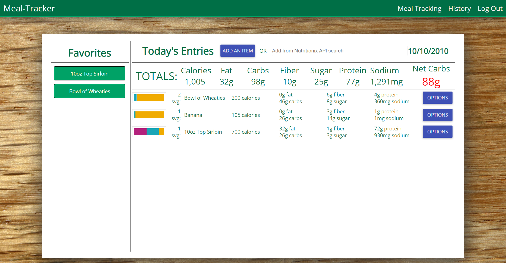

# Food-Tracker

Food-Tracker is a web application that allows the user to easily track daily dietary intake. When tracking meals, the user is able to see a running nutrient total for the day including calories, fat, carbohydrates, protein, and other nutritional information as well as view their historical daily entries. Food-Tracker also tracks net carbohydrate intake and will display this number in green if within a limit in line with a ketogenic diet, and will display in red if net carbohydrate intake exceeds this limit. For quick and easy nutritional information entry, Food-Tracker utilizes the Nutritionix API.

## Built With

MEAN Stack: MongoDB, Express, Angular 1.6, Node, Angular Material, sweetalert2, nodemailer, passport

## Getting Started

These instructions will get you a copy of the project up and running on your local machine for development and testing purposes. See deployment for notes on how to deploy the project on a live system.

### Prerequisites

- [Node.js](https://nodejs.org/en/)
- npm
- "angular": "^1.6.9",
- "angular-route": "^1.6.9",
- "bcrypt": "^1.0.3",
- "body-parser": "^1.18.2",
- "express": "^4.16.2",
- "express-session": "^1.15.6",
- "jquery": "^2.1.4",
- "mongoose": "^5.0.9",
- "passport": "^0.4.0",
- "passport-local": "^1.0.0",
- "path": "^0.12.7",
- "request": "^2.81.0",

### Installing

A Mongo database with 4 collections: users, usergoals, mealentries, and mealfavorites.

## Screen Shot

Coming soon.

### Completed Features

- [x] Incorporate Nutritionix API
- [x] View daily history
- [x] Save entries to favorites

### Next Steps

- [ ] Entry validation
- [ ] Improve styling

## Author

Chase Whitney
